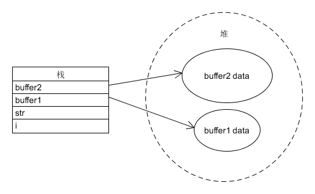
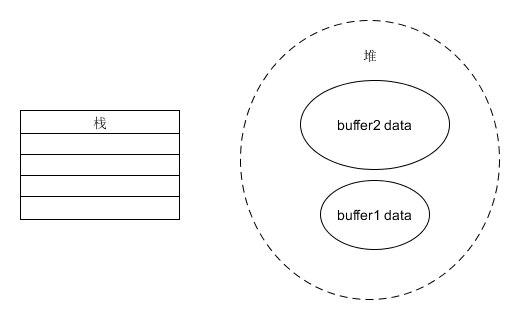

# 栈和堆

栈和堆的概念从何而来，已经不清楚了，只记得刚学编程时，看一本《C++编程思想》的书，里面有提到堆和栈，因为没有这方面的概念，所以看的似懂非懂，只知道这是内存上的某个东西，但是这个“堆”和“栈”具体是什么就不得而知了。

使用C++的时候，经常会使用局部变量，以及以new关键字生成的指针变量。声明完这些变量之后就可以使用了，然而很多人在使用完之后就弃之不顾了。如果使用的是其它带垃圾回收机制的高级语言那这么做是没问题的，但是现在使用的是C++，这也是C++与其它高级语言的不同之处，那就是它不会去自动释放某些内存，而需要程序员去写代码释放，否则会造成内存泄露。

虽然现在的操作系统以及硬件配置已经很强悍了，即使有内存泄露也当可以忽略，但是你要想像到，对于一个桌面端的程序，可以重新启动，重新刷新内存。而对于一个服务端或需要长时间运行的程序对这方面的要求就很高了，一个程序在后台不停的吃掉机器的内存，不仅程序自身会运行缓慢，还会影响其它程序，从而造成严重后果。再者，作为一个程序员，对于内存使用这方面一定要谨慎，这也是个人的职业素养，不能视而不见。

### 释放空间

那么究竟是哪些变量可以使用后不管，而哪些变量需要很小心的使用完成后将其释放。这就是栈和堆的区别了。

- 如果变量数据是保存在栈上，则不需要手动释放，计算机会自动释放。
- 如果保存在堆里，则需要程序员在使用完之后去释放。

至于具体哪些数据在堆上，而哪些数据在栈上保存。对于C++程序员来说，只需要记住用new或malloc申请的内存都是堆上的，其它的除全局变量和静态变量之外都在栈上，最常见的例子是局部变量。函数中的局部变量以及产生的临时变量按照顺序放入栈中，等函数执行完毕的时候，再从栈里将这个变量的内存一一回收。

> 全局变量和静态变量会被放到静态存储区里，这些会随着程序的结束被系统回收，也无须由程序员会释放，关于这个静态存储区在这里就不讨论了

### 来看一个简单的示例

	void foo()
	{
		int i = 0;
		char str[100]
		char* buffer1 = new char[100];
		char* buffer2 = new char[200]; // 1
	} // 2

当执行到代码 **1** 位置时，栈和堆的分配如下：

执行到位置 **2** 位置时，会将栈里的数据清空，但是堆的数据不变：

没有对 **buffer1** 和 **buffer2** 执行 **delete**，所以函数在执行完毕后 **buffer1 data** 和 **buffer2 data** 成了无效数据，也就是内存泄露。

内存泄露不断增多，会导致程序占用的内存越来越大，造成资源的浪费，直到关闭程序，内存泄露才会被操作系统回收。

### 从物理内存上来看

“堆”和“栈”表示的是变量所分配的地址空间。

“栈”的空间是连续的，后进先出，会与CPU寄存器一起工作，因此它的访问速度较快。但是它的空间是有限制的，不宜放过大的数据，否则会产生栈溢出，从而导致程序崩溃。例如无限递归的函数，不停的向栈中写入函数调用，导致栈溢出。

“堆”没有固定的顺序，在用户申请时，会从内存中找到空闲的、大小合适的内存块。堆一般不会溢出，除非所申请的内存已经大到超过计算机物理内存的程序。所以，堆适合存放大块的数据，但是它的存取速度相对于栈来说是较慢的。

### 其它知识点

多线程情况下，每一个线程都有自己独立的堆，而所有线程共享堆。

### 推荐与参考

[StackOverflow关于栈和堆的经典回答](https://stackoverflow.com/questions/79923/what-and-where-are-the-stack-and-heap)
